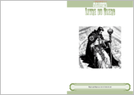
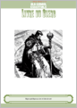
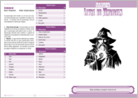
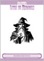
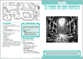
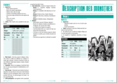
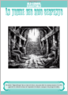

# Aide de jeu

## aides

| **Fichier**| **Description** |
| --: | :-- |
|  |  Règles spécifiques au clerc et listes de sort. Livret imprimable  |
|  |  Règles spécifiques au clerc et listes de sort  |
|  |  Règles spécifiques au magicien et listes de sort. Livret imprimable  |
|  |  Règles spécifiques au magicien et listes de sort  |
|  |  Cartes de sort pour Mage and Clerc.  |

## scenarii

| **Fichier**| **Description** |
| --: | :-- |
|  |  **La Tombe des Rois Serpents** : Scénario, Livret imprimable. La description des monstres y est absente  |
|  |  **La Tombe des Rois Serpents** : Description des monstres. Livret imprimable  |
|  |  **La Tombe des Rois Serpents** : Scénario "tutoriel" pour débutants. [source](https://coinsandscrolls.blogspot.com/2017/06/osr-tomb-of-serpent-kings-megapost.html)  |
